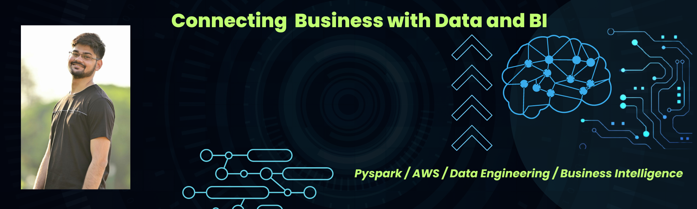

---
### Hi there 👋, Hi there 👋 Neelanjoy here !!
#### Data Engineer
I'm an enthusiastic data engineer with knowledge of KPI reporting, end-to-end pipeline deployment, and cost-cutting techniques. I enjoy using code to drive innovation and am skilled at building effective data input platforms. I enjoy using AWS stack for my solutions. Curently exploring Azure Data Stack.

### My Skills and Experience: 
- 🐍 Pyspark
- ☁️ AWS
- 💾 SQL
- 📊 Business Intelligence

        

